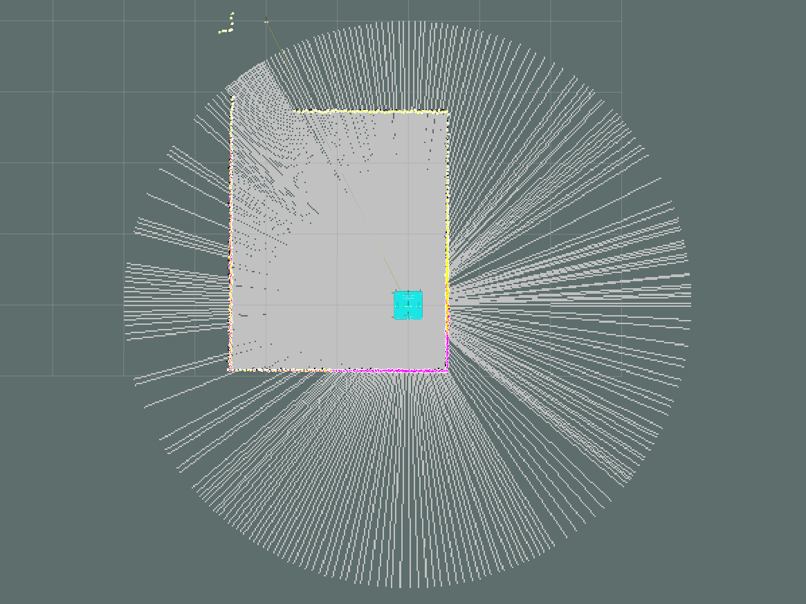
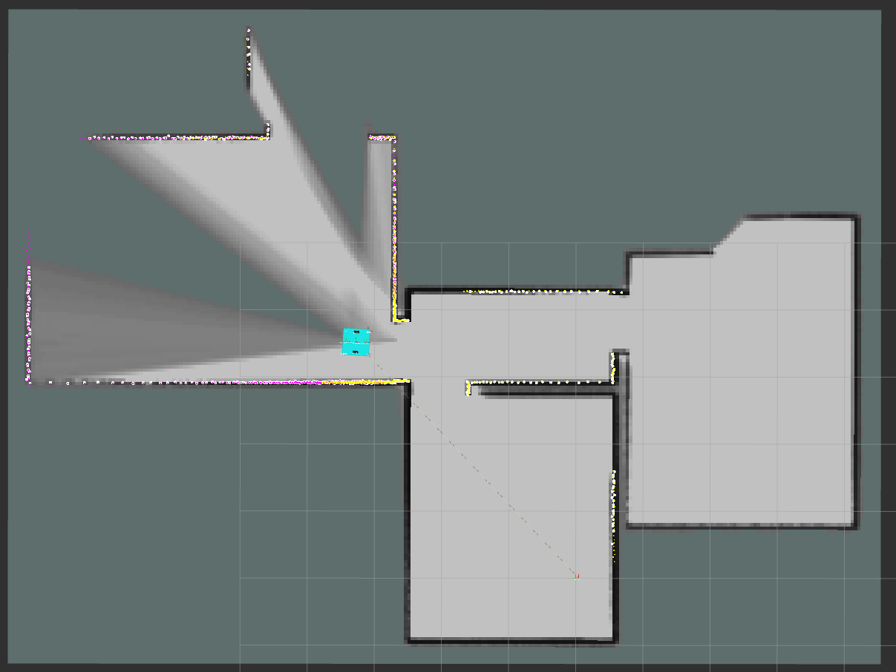
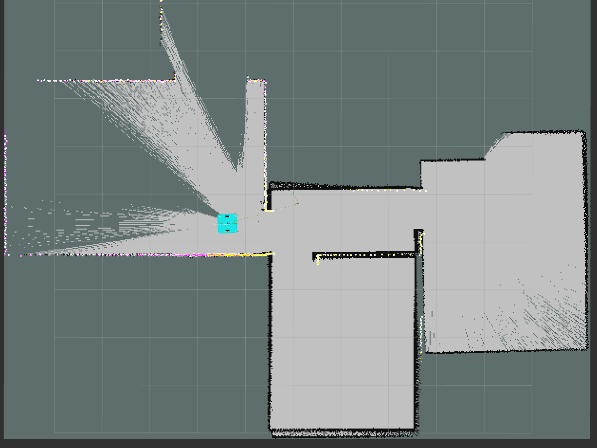
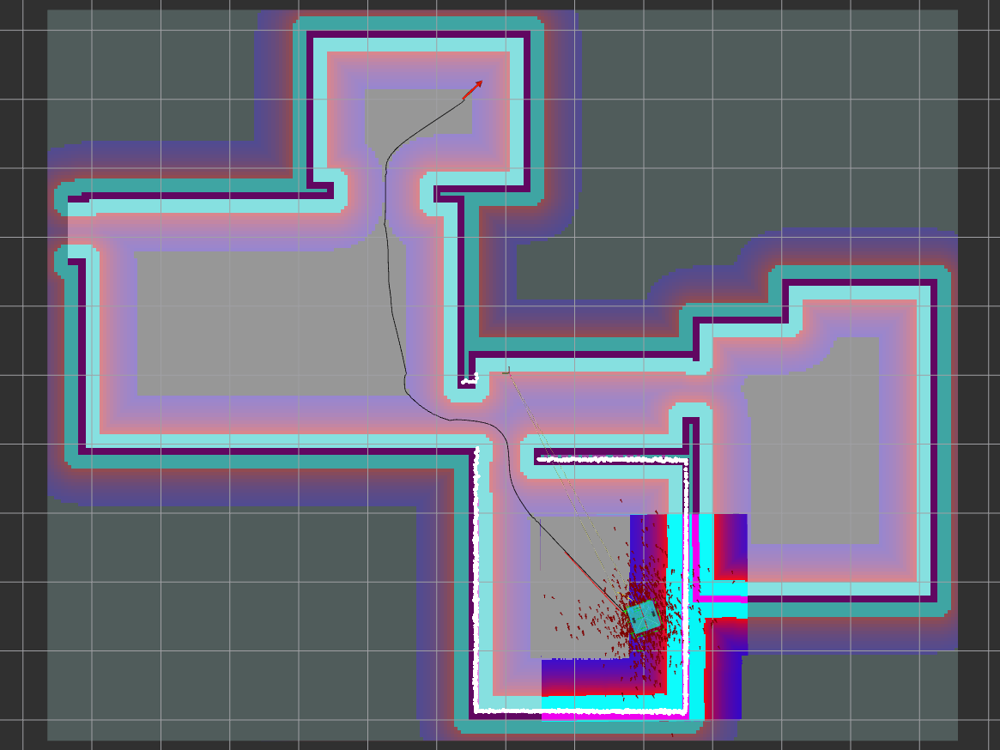
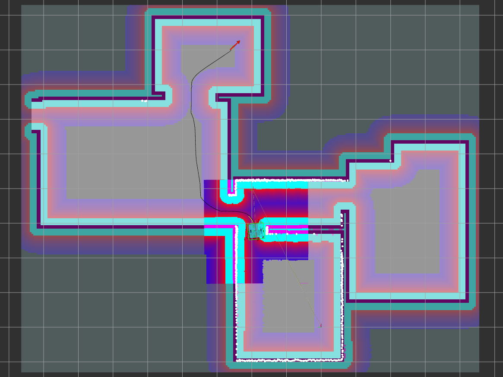
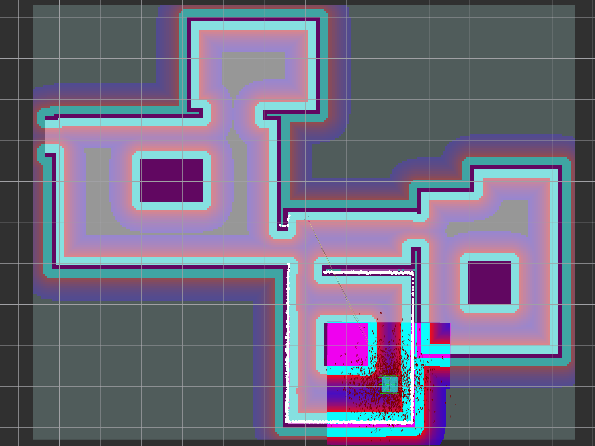
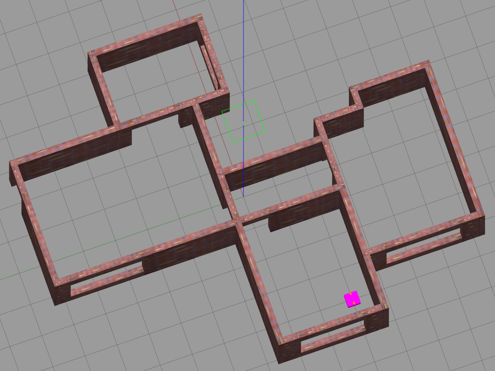
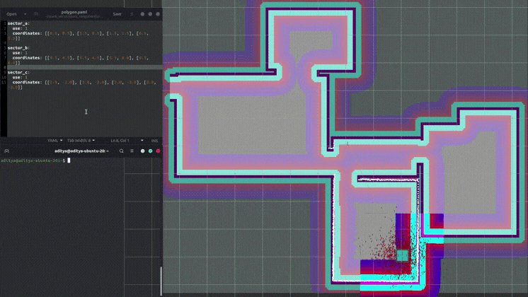

# SPARK

## Launch Sequence

**MAP GENERATION**

```py
roslaunch spark_gazebo spark_house.launch
# Robot State Publishers for the robot
# Spawns robot in gazebo
# LaserScan Merger
```

```py
roslaunch spark_slam gmapping.launch
# Gmapping

OR 

roslaunch spark_slam slamtoolbox_mapping.launch
# SlamToolBox

OR 

roslaunch spark_slam cartographer.launch
# Cartographer
```

```py
roslaunch spark_slam map_saver.launch map_name:=my_map
# Sae the Map
```

**NAVIGATION ON SAVED MAP**

```py
roslaunch spark_gazebo spark_playground.launch
# Robot State Publishers for the robot
# Spawns robot in gazebo
# LaserScan Merger
```

```py
roslaunch spark_navigation spark_navigation.launch
# Map Server
# AMCL
# MoveBase
```

**SLAM**

```py
roslaunch spark_gazebo spark_playground.launch
# Robot State Publishers for the robot
# Spawns robot in gazebo
# LaserScan Merger
```

```py
roslaunch spark_slam spark_slam.launch
# SLAM ToolBox Mapper
# MoveBase
```
> [!NOTE]
> For arena to load in gazebo copy `arena` directory within `spark_gazebo` package to `~/.gazebo/models `

**DYNAMIC PROHIBITED SECTOR**

```py
roslaunch spark_navigation prohibitor.launch
# Verify path to map and .yaml file
```

## Packages

<br>Description
<br>└── Launch
<br>&emsp;&emsp;    └── description ( Visualize tf and robot model )

- Laser Merger
  - Launch
    - laser_merger ( Merge LaserScan of both front and rear and produce a single LaserScan )
  - Node
    - ira_laser_merger

- Gazebo
  - Launch
    - empty_world ( Empty simulation env with robot )
    - turtlebot3_house ( Indoor simulation env with robot )
    - arena ( Arena for Robocon 24 )

- Control
  - Node
    - spark_teleop.py ( Teleop )

- Slam
  - Launch
    - map_saver ( save map in the navigation package )
    - gmapping ( map generation using gmapping package )
  
<p align="center">
	
</p>

    - cartographer ( map generation using cartographer )

<p align="center">
	
</p>

    - slamtoolbox_mapping ( map generation using slamtoolbox )

<p align="center">
	
</p>

    - spark_slam ( slam using any of the above mapping agent )

- Navigation
  - Launch
     - spark_amcl ( Localization of the robot in the env )
     - spark_move_base ( Navigation entity )
     - spark_navigation ( To start map server, amcl and move_base )

<table>
  <tr>
    <td></td>
    <td></td>
  </tr>
</table>

│   │   ├── gmapping.launch
│   │   ├── karto.launch
│   │   ├── map_saver.launch
│   │   ├── slamtoolbox_mapping.launch
│   │   ├── spark_slam.launch
│   │   ├── turtlebot3_frontier_exploration.launch
│   │   └── turtlebot3_hector.launch


  - Node
    - **Dynamic prohibition layer:** prohibitor.py ( Adds removes sectors within map as prohibited layer after reading from yaml )

<table>
  <tr>
    <td></td>
    <td></td>
  </tr>
  <tr>
    <td colspan="2"></td>
  </tr>
</table>

    - **Milestones:** milestones.py (Stores robot after every interval so in case of failure the robot can start from the milestone instead of home pose )